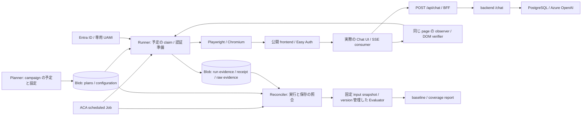

# SLI measurement implementation design

| 項目 | 値 |
| --- | --- |
| Status | Draft（設計案。実装・validation・baseline 収集前） |
| Date | 2026-09-16 |
| Owner | project owner（kmryst） |
| Issue | [#271](https://github.com/kmryst/felis-ai-chatbot/issues/271) |
| 設計判断 | [ADR-0029](../../adr/0029-sli-synthetic-execution-authentication-and-storage.md)（Proposed） |

## 目的と正本

手動で確認したブラウザ操作を定期実行し、supported client の SSE 受理時刻と当該試行の描画結果を保存して、
baseline を再計算できる構成を設計する。ユーザーから共有された通常回答の `message` → `done`、資料がない場合の
`notice` → `done` と画面表示は基本動作の確認であり、自動測定の validation、latency の実測記録、baseline ではない。

- [SLO document](../../operations/slo/slo-document.md): service scope、SLI specification、timestamp / clock、SLO の正本。
- [測定スキーマ](./sli-measurement-schema.md): 記録項目・型・状態値・算出方法・分類順序・coverage の正本。
- [Review runbook](../../operations/slo/slo-review-runbook.md): 実装検証から baseline、SLO 採用までの順序の正本。
- [共有 contract / fixture](../../contracts/chat-sse/README.md): SSE 文法・data schema・系列の正本。

本書は取得位置、保存構成、設定候補と実装計画を示す。以下の物理パス、manifest、observer は実装案であり、新しい SLI の記録項目名ではない。
既存スキーマは、実装前の命名整理として承認した field name / enum name / component name の変更を除き変更しない。
型、null 条件、measurement semantics、算出方法、classification rule、集計単位、期間帰属は変更せず、`docs/operations/slo/` も変更しない。
2 つの latency threshold と SLO target は未指定、SLO / policy は Draft のままである。
本 Issue で Azure / Entra ID の設定、アプリケーション、collector、JSON Schema、DB、scheduler を実装・変更せず、継続収集も開始しない。

## 構成と component の責任

採用案は、測定専用 Azure Container Apps（ACA）Workload profiles environment（Consumption workload profile）の scheduled Job、Playwright / Chromium、
専用 user-assigned managed identity（UAMI）、アプリケーション DB から分離した Azure Blob Storage である。
候補の観測範囲・coverage・cost・運用負担と採否は ADR-0029 に記録する。

| Component | 責任 | 実装・配置案 |
| --- | --- | --- |
| Planner | campaign の全予定、設定と期間の完全性を起動前に保存する | owner が実行する version 管理した CLI。有限の 35 日を先行作成し、実行結果から予定を生成しない |
| ACA scheduler / runner | 起動、予定との関連付け、claim、credential 準備、browser の操作、結果 upload | Japan East の専用 Workload profiles environment（Consumption workload profile のみ）。serving Environment / VNet に参加せず public FQDN を使用する |
| Browser observer | fetch 直前、受理 event、失敗検出、verifier 完了を同じ page で記録する | deployed supported client に任意の観測 hook を追加する。通常利用者の request を増やさない |
| Verifier | SSE contract とその試行の DOM を検証する | 共有 parser / fixture を再利用し、欠けている data schema / 系列検証と DOM 検証を追加する |
| Blob Storage | 予定、実行、raw evidence、payload を内包する receipt、snapshot、report を保持する | 専用 GPv2 / Hot / LRS。証拠の container と可変 coordination container を分離する |
| Reconciler | 予定、ACA 実行履歴、runner evidence、全 receipt を照合する | browser とは別の短時間 Job を毎時実行。手動で同じ処理を再実行可能にする |
| Evaluator | 固定 snapshot の入力検証、派生値の再計算、分類、coverage 集計、report 再生成を行う | version 管理した TypeScript CLI / container。Evaluator の実行に実 LLM は不要 |

独立ストレージは PostgreSQL 障害中の記録を可能にするが、Azure / region の共通障害は残る。
runner の障害で試行自体が失われる場合は予定 coverage の gap とする。別 region / Azure 外の観測点は、初回 baseline の限界を確認後に再検討する。

## 実行、予定、認証

### 予定と job execution の対応

1. Planner は開始・終了時刻、予定数、設定の固定参照を campaign manifest に保存し、各回に別の `schedule_id` を付ける。
   各予定の `scheduled_for` と `execution_purpose` は起動前に固定する。全予定の読み戻しと digest 検証後に campaign を有効にする。
   途中までしか保存できた campaign は有効にしない。
2. ACA cron は runner を起動する契機とする。実行名と Job resource ID を `run_id` の根拠として保存し、
   現在時刻以前の最新予定のうち、起動許容遅延内の未 claim の予定を選ぶ。configuration が異なる予定は選ばない。
   ACA の実行開始時刻から `scheduled_for` を生成しない。
3. campaign 全体の lease と既存 execution の状態を確認し、予定ごとの claim を create-only で保存してから browser を起動する。
   過去の execution が動作中または状態不明なら送信しない。lease の期限切れだけでは引き継がず、前 execution の終了を確認する。
   lease 更新失敗時は新規送信を止め、進行中の観測は打ち切り証拠を残す。lease 取得・更新は t0 より前に行う。
4. 一度 claim した予定への自動 HTTP 再送はしない。runner 再起動後も送信済みか不明なら再送しない。
   手動再実行で実際に別 request を送る時は新しい `attempt_id` を使用し、同じ予定への関連を保持する。
5. 起動許容遅延を過ぎた予定の request を後から補充しない。予定は残し、Reconciler が実行・保存の証拠を照合する。
   この dispatch 方針を、遅れて発見された試行を破棄する規則にはしない。実際に送信されたものは遅延にかかわらず保存する。

`parallelism = 1` は一つの execution 内の設定であり、別 execution 間の排他を保証しない。
ACA の execution history は直近 100 件なので、Reconciler は毎時その履歴を永続化する。
監視中断で履歴が切れた場合に `missed` を推定しない。Reconciler 自身の実行・照合区間・取得成否も保存する。
起動しなかった job execution のために attempt record や `attempt_started_at` を作らない。
根拠: [ACA Jobs](https://learn.microsoft.com/en-us/azure/container-apps/jobs)、
[組み込み環境変数](https://learn.microsoft.com/en-us/azure/container-apps/environment-variables#built-in-environment-variables)。

### 認証主体と credential

frontend API の app registration で定義した app role `Chat.Use` を、frontend API の service principal（enterprise application）を resource として、
synthetic 専用 UAMI を表す service principal に割り当てる。
[ADR-0027](../../adr/0027-frontend-azure-deployment-and-public-surface.md) と
[Entra 準備手順](../../operations/entra-easy-auth-setup.md)の synthetic 用 service principal として扱い、既存の ACR pull identity は流用しない。
runner は Managed Identity endpoint / Azure Identity SDK で frontend API を対象とする短期 access token を取得する。
取得・期限確認・必要な更新を POST 前に終え、試行途中に認証エラーを理由として自動再送しない。
token 値、password、cookie、`CHAT_API_KEY` は記録しない。設定には認証方式、tenant / principal ID、対象 audience、identity resource ID だけを残す。

| 権限・変更 | 必要な範囲 / 担当 |
| --- | --- |
| frontend 利用 | 専用 UAMI への `Chat.Use` app role 割当。Entra 管理権限を持つ owner が後続作業で実施 |
| image 取得 | ACR scope の `AcrPull` |
| 保存 | plans / configuration の読み取り、runner 用 evidence / receipt の作成・読み取り、coordination の lease 操作。予定の変更権限は与えない |
| 照合 | Reconciler の別 identity に Blob 読み取り・照合履歴の追記と対象 Job / execution / app の明示的な ARM read 権限 |
| 設定と認証検証 | API の application ID URI と Easy Auth の issuer / audience を確認し、必要な変更を後続 PR / plan に明示する |

runtime に Graph の directory 管理権限、Azure Contributor、Job の start / write / listSecrets、backend key は不要。
Blob の write 権限だけでは上書きを防げないため、証拠の保持は後述の WORM policy と組み合わせる。
Managed Identity の app role 割当は公式に可能だが、**現行 Easy Auth がこの token を受理することは未検証**である。
`terraform/ephemeral/main.tf` の issuer / client ID と実際の `iss` / `aud` の整合、割当ありの成功、未割当・別 audience・期限切れの拒否を prototype の gate にする。
通らなければ audience / app registration の構成を修正して再検証し、principal header の偽装や BFF check 無効化で通さない。
根拠: [MI への app role 割当](https://learn.microsoft.com/en-us/entra/identity/managed-identities-azure-resources/assign-app-role-managed-identity-powershell)、
[ACA daemon client authentication](https://learn.microsoft.com/en-us/azure/container-apps/authentication-entra#daemon-client-application-service-to-service-calls)。

### ブラウザでの認証と観測範囲

Playwright は新しい BrowserContext を毎回作り、deployed frontend の入力欄・送信ボタンを操作する。
初期 HTML / static assets の GET は exact frontend origin に限定して `route.fetch({ maxRedirects: 0 })` で認証付き取得し、
3xx は拒否する。実 response を browser に渡し、context 全体への Authorization header 設定は使わない。
測定 POST は synthetic 用の同期準備 hook が exact origin と `/api/chat` を照合し、Bearer と `redirect: "error"` を設定する。
その後に request body と options を固定し、t0 を取得して native `fetch` を呼ぶ。POST の SSE は Playwright 側で代理取得・buffer・再構成しない。
token は runner / browser のメモリ内だけに置き、HAR、trace、storageState、console へ出力しない。
別 origin・redirect への token 漏出がないことを負の試験で確認する。

初期 GET の代理取得、routing による HTTP cache 無効、service worker 無効を configuration に固定する。
この構成はページロード時間、人間の対話ログイン / MFA / cookie 更新、実利用者の browser・network 分布を測らない。
`attempt_started_at` 前の画面起動や credential 準備失敗は execution / coverage の証拠である。
POST の DNS / TLS / ingress は経路に含むが、既に接続・cache が存在する場合があり、毎回 cold connection を測るとは主張しない。
根拠: [route.fetch](https://playwright.dev/docs/api/class-route#route-fetch)、
[routing の制約](https://playwright.dev/docs/api/class-browsercontext#browser-context-route)、
[Fetch redirect mode](https://fetch.spec.whatwg.org/#concept-request-redirect-mode)。

## 測定と browser verifier

### 現行コードの再利用と追加点

| 現行箇所 | 再利用するもの | 後続実装で追加するもの |
| --- | --- | --- |
| [Chat UI](../../../frontend/app/chat.tsx) | 入力・送信、`fetch("/api/chat")`、累積 text と最終表示、停止操作 | fetch 直前の観測、request options の準備、`attempt_id` と `assistantId` の関連、当該 DOM の識別属性と終了状態 |
| [SSE parser](../../../frontend/lib/chat-sse/parser.ts) | byte 分断を扱う incremental framing / JSON parse | strict UTF-8 / event data schema の検証結果、受理済み event を失わない通知 |
| [SSE consumer](../../../frontend/lib/chat-sse/consumer.ts) | 累積表示・終端・撤回の処理 | 受理 event と失敗の同期 observer。`reader.cancel()` より前の終端時刻 |
| [共有 fixture](../../contracts/chat-sse/README.md) | `wire_sse`、期待 event、error class、byte 分断パターン | 同じ fixture を browser verifier と Evaluator に適用し、欠測・DOM・clock の case を追加 |

現在の consumer は空 content を無視でき、content のない `done` も返し、最初の終端後に cancel する。
parser の `TextDecoder` も strict UTF-8 検証を指定していない。従って consumer の戻り値をそのまま `sse_validation_status = passed` にしない。
共有 contract の data schema、正常系列、notice / message 混在、空 content、不正 class、多重終端を追加 verifier で検証する。
すでに read した bytes の終端後 event / 不正データも検査する。cancel 後に未読の bytes が存在しないことや remote EOF は証明しない。
consumer の仕様を変える必要がある箇所は後続実装の変更として review し、この設計 PR で変更済みとは扱わない。

### 時計と取得位置

一つの page / document の `performance.now()` を使う。Playwright / Node の時計や callback 到着時刻は latency の算出に使わない。
観測 hook と依存する初期化は一つの `addInitScript` にまとめ、page script より先に設置する。
browser 内の同期 buffer へ記録し、hook で upload や `exposeBinding` の Promise を await しない。
根拠: [addInitScript](https://playwright.dev/docs/api/class-browsercontext#browser-context-add-init-script)、
[exposeBinding](https://playwright.dev/docs/api/class-browsercontext#browser-context-expose-binding)。

| 取得位置 | 記録 |
| --- | --- |
| ID と request body / 認証の準備後 | 予約した `attempt_id` と run / schedule の関連を先に保存する。予約は送信証拠にしない |
| native fetch の直前 | `attempt_started_at` と t0 を同じ page で取得。直後の fetch まで非同期処理・保存待ちを挟まない |
| HTTP response / network failure | status、content-type、失敗根拠を記録。受信後に `http_status_code` を消さない |
| event の framing / UTF-8 / JSON / data schema 検証後の consumer 受理 | 受理順の `sequence_number`、event、t0 からの未丸め `elapsed_ms`。系列違反を後で検出しても受理済み記録を消さない |
| 失敗確定・timeout 打切り | 同じ時計で最初の `failure_elapsed_ms` を取得し、理由を保存してから abort / cleanup |
| DOM verifier 完了 | 同じ page で `attempt_duration_ms` と `completed_at` を取得。serialize / upload はその後 |

全 `sse_events` と派生 latency はスキーマの式に従い、同一 read の event が同時刻でも補間しない。
`done` 受理と cleanup 完了を分離する。有効な正常系列でない `done` は `terminal = done` を残しても
`sse_validation_status = failed`、`response_time_ms = null` とする。render 失敗だけなら有効な `response_time_ms` は保持する。
page crash / navigation / browser 再起動で clock の連続性を失えば別 process の値を接続しない。
失われた event 列は null、残存した部分列は別 evidence とし、完全な `[]` に置換しない。

### 当該試行の描画証拠

verifier は `attempt_id` と結び付いた assistant DOM 要素を対象に、当該 response の content から期待表示を導く。
新しい BrowserContext と一意な要素 ID により以前の回答を誤認しない。
browser 内で DOM commit 後の `textContent` の完全一致、要素の接続、表示領域、computed style、送信終了状態を確認し、
成功 / 不一致 / 観測不能の evidence と最終 screenshot を attempt に関連付けて保存する。
失敗時は確認できた DOM と原因を残す。HTML / CSS による非表示を SSE 成功だけで上書きしない。

通常 / notice では、その試行で受理した text の連結と最終 DOM を照合する。
`content_filter` では撤回の固定文言と元の partial text の除去を確認し、partial text の表示前後も記録する。
React が複数 event を一度に commit することは許容する。各 event の個別 frame 表示、GPU paint、実ユーザーが読めたことまでは証明しない。
fixture で撤回を再現した結果は `validation_result_ref` で関連付け、発生していない本番試行の撤回を観測済みにしない。

`toHaveText(string)` は空白を正規化するので完全一致の証拠には使わず、retry 付きの raw `textContent` 比較を行う。
`toBeVisible()` だけでは `opacity: 0` も通るため、祖先を含む computed style と対象の表示領域も検査する。
最終判定時刻は browser 内で取り、Playwright が結果を回収した時刻に置き換えない。
DOM を検査できない時は `not_observed`、検査して不一致を確認した時は `failed` とする。
根拠: [toHaveText](https://playwright.dev/docs/api/class-locatorassertions#locator-assertions-to-have-text)、
[Playwright visibility](https://playwright.dev/docs/actionability#visible)。

## 保存、receipt、照合

### 記録項目の取得元と保存先

以下の field group は[スキーマ](./sli-measurement-schema.md)の項目を列挙したもの。型・enum・算出方法はそちらを参照する。
物理 container は書き手ごとに権限を分け、下表の prefix を配置する。run / collection の状態変化も上書きせず履歴を追加する。

| 項目 | 取得元・書き手・取得位置 | 保存先 |
| --- | --- | --- |
| `schedule_id`, `scheduled_for`, `execution_purpose` | Planner が起動前に確定。run / attempt の複製値はその参照から取得 | `plans/`、run / payload 内の参照・複製 |
| `schema_version`, `configuration_version` | Planner が固定した schema と設定。各書き手が検証して付与 | `configuration/` と全記録 |
| `run_id`, `execution_status`, `execution_error_type` | ACA execution metadata と runner の lifecycle。Reconciler が照合 | `runs/`, `reconciliation/` |
| `attempt_id`, `attempt_start_status`, `attempt_started_at` | runner の ID 予約、browser の fetch 直前通知と送信証拠。開始不明を別記録 | `runs/` の予約・開始 evidence、receipt 内 payload |
| `completed_at`, `attempt_duration_ms`, `failure_elapsed_ms` | 同じ browser document の verifier / failure observer | receipt 内 payload |
| `sse_events[].sequence_number`, `.event`, `.elapsed_ms` | browser consumer の同期 observer | receipt 内 payload、対応する bytes は `evidence/` |
| `time_to_first_output_ms`, `inter_chunk_latency_ms`, `last_content_to_done_duration_ms`, `response_time_ms` | collector が完全な event 列と系列検証から算出。Evaluator が再計算して一致を照合 | receipt 内 payload、再計算は `reports/` |
| `terminal`, `http_status_code`, `error_type`, `error_class` | consumer、HTTP response、失敗検出の根拠。最初の確定した原因を保持 | receipt 内 payload、補助 evidence |
| `sse_validation_status`, `render_status`, `verification_method` | 当該 browser の strict verifier と DOM evidence。browser 実行では `browser` | receipt 内 payload、`evidence/` |
| `collector_version`, `client_version` | runner image / code、実際に読み込まれた frontend build の証拠 | payload と version manifest |
| `deployment_revision`, `image_digest` | 対象 revision の ARM / image metadata と当該 request の対応証拠 | payload と `evidence/` の deployment snapshot |
| `validation_result_ref`, `slo_version` | 当該 configuration / collector / client の検証記録と有効版。未検証 / 未採用なら null | payload、固定した validation manifest |
| `receipt_id`, `received_at`, `payload_digest`, `payload_ref`, `ingested_at` | receipt envelope と Blob service properties。時刻の方法は次節 | `receipts/` とその properties、照合履歴 |
| `collection_status`, `collection_error_type`, `payload_integrity_status` | upload 結果と保存先の全 receipt を Reconciler が照合。raw payload の外側 | `reconciliation/` |
| `eligibility`, `outcome`, `classification_reason`, `evaluator_version` | 固定 input snapshot と設定を使う Evaluator。raw を変更しない | `reports/` |
| `schedule_coverage_start`, `schedule_coverage_end`, `scheduled_count`, `schedule_coverage_status` と全 gap count | Planner manifest、run、attempt、receipt、照合証拠を Evaluator が独立集計 | `reports/`。field 名・単位はスキーマ「予定 coverage の集計」をそのまま実装 |

raw evidence は、受信した response bytes / byte chunk 順序、検証ログ、DOM 内容・表示状態・screenshot、
attempt の予約 / 開始通知、ACA execution 情報を含む。認証 header を含む request 全体の dump は保存しない。
予約後、開始通知前に runner が失われた場合は、送信したか不明という evidence を残す。
送信を確認できて開始時刻だけ失われた場合と区別し、schema の `unknown` / `started_at_unavailable` を使う。

### 原子的な結果保存と保存先の時刻

1. raw evidence を新しい Blob 名へ保存し、読み戻しと digest を確認する。
2. immutable measurement payload の canonical bytes を作る。payload と evidence digest / 固定参照を含む receipt envelope を
   `receipts/<attempt_id>/<receipt_id>.json` へ単一の `Put Blob`、`If-None-Match: *` で作成する。
   payload bytes は base64 等でその envelope に内包し、`payload_ref` はその位置を指す。payload と receipt の別書きによる片側だけの公開を避ける。
3. `Get Blob Properties` の `x-ms-creation-time` を読み、受領・永続化した receipt の `received_at` とする。
   immutable 本文と保存先 properties の組を論理的な receipt とし、本文へ時刻を追記して書き換えない。
4. 同一 canonical bytes / digest の結果について最初の creation time を `ingested_at` とする。
   再送時刻で上書きせず、conflict の場合は各 payload の永続化時刻と全 receipt を残して一つの採用結果を作らない。

`x-ms-creation-time` は保存先の RFC 1123 の秒精度 timestamp であり、UTC RFC 3339 の `.000Z` に変換する。
`.000` は形式の補完でありミリ秒精度の実測を意味しない。HTTP `Date`、変更可能な `Last-Modified`、producer 時刻は使わない。
properties の取得失敗時は時刻を捏造せず `collection_status = unknown` とし、再照合する。
PUT 成功後・応答喪失時も Blob の本文と properties から確認できる。
evidence 保存後・envelope 作成前の crash は orphan evidence として保持し、完全な結果として数えない。
根拠: [Get Blob Properties](https://learn.microsoft.com/en-us/rest/api/storageservices/get-blob-properties)、
[conditional headers](https://learn.microsoft.com/en-us/rest/api/storageservices/specifying-conditional-headers-for-blob-service-operations)。

### Canonicalization と再送

prototype の `schema_version` に RFC 8785 JCS / UTF-8 / SHA-256 と入力 field の一覧を固定する。
対象は期間帰属・scope・latency・分類に影響する全 raw field、`schema_version`、固定設定・code・evidence 参照と digest。
receipt metadata、`ingested_at`、collection lifecycle、Evaluator の分類結果は含めない。
配列順・Unicode を保持し、latency を丸めない。duplicate key、不正 Unicode、非有限数を拒否する。
JCS 化できない入力も bytes と受領証拠を quarantine に残し、不正な ID / 開始状態を補正しない。
根拠: [RFC 8785](https://www.rfc-editor.org/rfc/rfc8785)。

upload を再実行するたびに新しい `receipt_id` を使用し、同じ測定結果は同じ `attempt_id` と canonical bytes を保持する。
HTTP transport の同じ PUT の再試行は同じ receipt 名へ create-only で行い、412 は既存本文との一致を確認する。
Reconciler は全 receipt の bytes **と** digest を比較し、一致する場合だけ結果 1 件として扱う。
異なる bytes または digest があれば全 variant を残し、先着・後着・多数決で選ばない。
conflict の開始状態 / event time / scope が一致するかによる分類はスキーマの順序に従う。
payload の不一致と、同じ予定で実際に送信した別 attempt を混同しない。

### 保持、欠測、保存障害

証拠 container は container-level WORM の time-based retention を使用し、protected append writes は無効にする。
初期候補は 120 日。35 日の事前予定、28 日以上の観測、遅延到着と再検証を含めるためである。
prototype の disposable container で policy を検証してから baseline 用を lock する。lock は後続インフラ変更の plan に含める。
自動削除は初回 baseline 中は設定せず、report が参照する全 input を保持する。review 継続で 120 日を超える場合は期限前に retention を延長する。
coordination の lease / 停止状態は別の可変 container に置き、変更履歴を証拠 container へ追記する。
根拠: [container-level WORM](https://learn.microsoft.com/en-us/azure/storage/blobs/immutable-container-level-worm-policies)。

| 状況 | 保存と照合の扱い |
| --- | --- |
| job execution 未起動 | 事前予定を残す。期限超過かつ scheduler / runner 証拠が完全なら `missed`、不完全なら `unknown`。架空の attempt は作らない |
| POST 前の credential / browser 準備失敗 | job execution の `failed` と理由。予約済み attempt があれば `not_started`、なければ job execution の evidence のみ |
| 開始時刻の欠落・開始状態不正 | raw evidence を残し、対応する gap count。`scheduled_for` で期間を補わない |
| 保存拒否・serialize 失敗 | `failed` と原因。送信後の失敗結果を成功にも除外にもしない |
| 保存応答喪失・保存先到達不能 | `unknown`。結果の有無を再照合し、経過時間だけで `missing` にしない |
| 期限まで結果がない | 完全な照合と開始証拠がある時だけ collection の `missing`。attempt record 不在の予定は期限と証拠により pending / missing の gap count |
| 遅延到着・復旧後の再送 | 元の schedule / attempt に追加し、状態履歴と新しい input snapshot を保存。既存 report は上書きしない |
| receipt 同一性不明・conflict | それぞれの integrity status と gap。全 receipt を保持し、coverage 不足を隠さない |

開始時刻が不明な gap、未関連付けの evidence、coverage interval 外の予定も、対象 SLO window へ影響し得るかを確認する。
実行許容遅延や照合期限はその確認を省く根拠ではない。

## Baseline configuration の初期候補

以下は実測前の候補であり、latency threshold / SLO target ではない。prototype と短期 validation の結果をもとに版を固定する。

| 設定 | 初期候補 | 根拠・検証と決定条件 |
| --- | --- | --- |
| 通常回答 payload | `{"message":"最強の台風は？"}` | 手動で message 系列が確認された質問。実 deployment / corpus でも通常系列を得られるか検証する |
| notice payload | `{"message":"このサービスの参照資料に載っていない架空の惑星ゼフィラの首都は？"}` | no-context 候補。質問だけでは guard を保証しないため、prototype で notice を確認してから固定する |
| payload 比率 | 通常 : notice = 1 : 1、別予定として交互 | 両 path の証拠を得るための便宜的な分布。実ユーザーの分布とは扱わず、観測した通常回答 / notice の系列別の分布も報告する |
| campaign / schedule | 有限の 35 日、UTC 毎時 `:07` / `:37`。cron `7,37 * * * *` | 28 日以上の baseline と前後確認の余裕。30 分間隔で 28 日 1,344 予定、35 日 1,680 予定 |
| location / browser | Japan East、専用 Workload profiles environment（Consumption workload profile）、headless Chromium、viewport 1280 × 800 | 一つの再現可能な観測点から開始。Playwright / browser / container digest を固定する |
| runner resource | 1 vCPU / 2 GiB | Chromium の初期候補。OOM・CPU 競合と観測 overhead を測り、足りなければ変更後に再検証する |
| concurrency / retry | campaign 全体 1、Job の `parallelism` 1 / `replicaCompletionCount` 1 / `replicaRetryLimit` 0、HTTP 自動再送なし | 低負荷と二重送信抑制。重複 execution / lease 喪失試験を通す |
| measurement timeout | fetch から 120 秒 | 観測上限の初期候補。ingress timeout を根拠にしない。打切り割合・末尾 content の分布を見て、必要なら延長して再収集する |
| DOM verifier 猶予 | 有効終端 / failure 後 5 秒 | 通信の latency へ足さず、当該試行の表示確認用。低 CPU 条件でも誤失敗しないか検証する |
| bootstrap / Job 上限 | 認証・画面準備 60 秒、Job 300 秒 | 120 秒の観測と DOM・保存終了処理を収める初期上限。強制終了時の gap を確認する |
| 起動許容遅延 | `scheduled_for` から 5 分 | 次の予定を待って埋め合わせをしないための dispatch 制限。実起動遅延を確認して固定する |
| attempt record 判定期限 | `scheduled_for` + 15 分 + 猶予 15 分 | Job の上限・upload・起動遅延を含む。期限と完全な照合証拠の両方が必要 |
| 収集欠落判定期限 | 既知の `attempt_started_at` + 15 分 + 猶予 15 分 | 既知の開始からの待機候補。開始不明をこの式で補完しない |
| Reconciler | UTC 毎時 `:17`、手動再照合可能 | 100 件の execution history が失われる前に保存する。reconciler outage / history 切れを検証する |
| retention | 120 日、初回自動削除なし | 予定の先行作成・baseline・review を含む。長期保持の要否は baseline review で判断 |

payload の想定 path が変わった場合も、response を見て `execution_purpose` を変更しない。有効な通常 / notice の双方は既存 SLI の正常系列である。
分布が変わった事実を記録し、representativeness を再検討する。notice を得るために本番 DB や RAG threshold を変更しない。
候補を確定できなければ notice の deterministic な試験は fixture の `validation` で行い、baseline payload の決定を保留する。

### Configuration と deployment の固定参照

configuration snapshot は payload bytes、上表の全設定、認証主体と参照、schema / collector / evaluator の版、
ブラウザ環境、事前の data quality 判定基準を含め、digest を付けた immutable Blob と repository commit に対応させる。
`validation` / `drill` は目的別の設定と予定を作り、baseline 予定の `execution_purpose` を変更しない。

実際の frontend build ID / commit は image の build metadata と読み込んだ asset の対応から確認する。
backend / frontend revision と image digest は ARM の配置情報だけで推測せず、実 request との対応を確認する。
単一 revision であることと、その期間の traffic / image 対応の証拠を取れる場合に値を設定する。
複数 revision に分散して特定できなければ component の値を null とし、配置 snapshot を残す。
計画 image、作業 checkout の HEAD、latest tag で代用しない。版が確認できない観測は保存するが baseline の比較可能性の gate は通さない。

### 費用見積りと停止方法

2026-09-16 の Azure Retail Prices API で確認した Japan East の PAYG USD 単価を計算の入力とする。
CPU active は 0.000024 USD / vCPU 秒、memory active は 0.000003 USD / GiB 秒。
resource inventory の GPT-4.1-mini GlobalStandard を仮定すると入力 0.0004 USD / 1K tokens、出力 0.0016 USD / 1K tokens。
これは現在稼働中の model を API で確認した記録ではない。campaign 開始前に実 model / SKU / region と価格を再確認し、価格応答も snapshot に残す。
根拠: [Retail Prices API](https://learn.microsoft.com/en-us/rest/api/cost-management/retail-prices/azure-retail-prices)、
[ACA pricing](https://azure.microsoft.com/en-us/pricing/details/container-apps/)、
[Azure OpenAI pricing](https://azure.microsoft.com/en-us/pricing/details/azure-openai/)。

| 対象 | 28 日の試算・算出条件 |
| --- | --- |
| Browser Job | 1 vCPU / 2 GiB × 60 秒 × 1,344 回なら **2.42 USD**。毎回 300 秒なら **12.10 USD**。image 起動を含む実課金時間で再計算する |
| Chat generation | 通常 672 回 ×（入力 4,000 + 出力 500 tokens）なら **1.61 USD**。notice 候補も全回生成になれば **3.23 USD**。token 数は仮定で上限ではない |
| Embedding | 全 1,344 回で実行。`合計 input tokens / 1,000 × 実 deployment の単価` を追加する。notice でも embedding は必要 |
| Reconciler | 0.25 vCPU / 0.5 GiB × 30 秒 × 672 回の仮定で **0.15 USD** |
| Storage | 1 attempt あたり evidence 1 MiB の仮定で 28 日 **1.31 GiB**。raw / receipt / run / report と再送分を加え、`GiB-month × Hot LRS 単価 + 各操作回数 / 10,000 × 操作単価` で積算する |
| その他 | ACR の追加 image、Log Analytics ingest / retention、network 転送を実使用量で加算する。既存 serving の固定費と分ける |

60 秒 / 全回生成の仮定では browser + generation + reconciler が **5.80 USD / 28 日**、35 日では **7.25 USD**。
保存・embedding・ログ・転送を含む総額ではない。これらは prototype の bytes、token 数、操作数と契約価格を使って埋める。
30 分から 5 分間隔へ変えると同じ条件の呼出数・実行費は 6 倍になる。
ACA 無料枠は subscription 共有なので試算から差し引かない。LLM token 数と backend retry により、Job timeout だけで費用上限は保証できない。

初期の予算候補は全追加費用 **15 USD / 35 日**。owner が prototype 実測で総額と停止条件を確定するまで定期収集を開始しない。
runner は campaign の終了時刻・最大予定数と送信前の停止状態を必須確認し、余分な自動 request を作らない。
日次で実費と見込みを照合し、予算超過見込みなら以降を停止する。Microsoft Cost Management の budget alerts だけを即時停止装置としない。

停止は campaign の停止状態と時刻・理由を先に記録し、新規 dispatch を無効化して active execution を停止する。
未実行予定と途中結果は保持し、停止後に成功予定へ書き換えたり coverage から自動除外したりしない。
Job / scheduler の停止・削除は後続運用の手順で行い、Blob 証拠は残す。
MI role の削除だけでは token cache により直ちに止まらないため、緊急停止は Job / campaign 側で行う。
根拠: [Managed Identity の cache](https://learn.microsoft.com/en-us/azure/container-apps/managed-identity#configure-a-target-resource)。

## 固定入力からの再集計

1. 予定・run・attempt・全 receipt・evidence・設定を列挙し、本文と server properties、URI、ETag、digest を input manifest に固定する。
   評価時点、対象 window、予定 coverage interval、evaluator / schema / configuration / SLO の版を保存する。
2. List Blobs の複数 page を原子的な snapshot とみなさない。初回の確定 report は campaign 終了後、runner と upload / Reconciler の書き手を
   drain し、全 run の終端または不明状態と照合できる閉じた入力を export する。途中 report は暫定 snapshot と完全性の限界を記録する。
3. schema validation、予定の不変な `execution_purpose` と複製値の照合、ID / 開始状態、全 receipt の同一性を検査する。
   `sse_events` から派生値を再計算し、保存済み値と不一致なら data quality error とする。
4. Evaluator はスキーマの分類順序をそのまま実装する。baseline の未指定 threshold は `not_evaluated`、raw の失敗事実は保持する。
   validation / drill の除外より前に execution purpose の不一致を検査する。候補 threshold の分析は用途・候補・snapshot を明記し、`slo_version = null` を維持する。
5. 有効な `attempt_started_at` により UTC の `[window_start, window_end)` へ帰属させる。
   開始時刻不明の試行には window の classification result を作らない。receipt 到着、完了時刻、予定時刻で補完しない。
6. 予定 coverage は `scheduled_for` と別 interval から独立計算する。分類が途中で終了しても全 gap count を収集する。
   同一結果の receipt 数で attempt count を増やさず、実際に送信した別 attempt は数える。
7. interval 外の予定と未関連付けの evidence を含め、当該 window への影響を否定できない gap を確認する。
   coverage / data quality 不足と不明な結果を併記し、SLO compliance / error budget を計算しない。
8. 同じ snapshot と Evaluator から同じ出力を再生成する。late ingestion / conflict の発見では新しい snapshot と report を追加し、旧記録を残す。

確定 baseline report は観測した通常回答 / notice の系列別の latency 分布、failure、right-censoring、版の変化、予定と実行の gap を含む。
継続的な正式 SLO 評価で、動作中の writer と整合した snapshot の完全性をどう保証するかは後続の有効化作業で検証する。
初回の有限 campaign の drain を、連続運用の snapshot が検証済みである根拠にはしない。
根拠: [Blob concurrency / consistency](https://learn.microsoft.com/en-us/azure/storage/blobs/concurrency-manage)、
[List Blobs](https://learn.microsoft.com/en-us/rest/api/storageservices/list-blobs)。

## 検証計画と実装順序

### Runbook の必須 case と証拠

CI では [ADR-0004](../../adr/0004-stub-llm-and-no-llm-in-ci.md) に従い実 LLM を呼ばない。
ローカルの supported client + BFF + stub / 共有 fixture で決定的な故障注入を行い、Azure の認証・保存境界は別の検証 campaign で確認する。
全 test traffic は予定作成時に `validation` / `drill` として宣言する。
分類器の good / bad 試験には固定した人工の候補 threshold を使い、baseline / 正式 SLO と混同しない。

| 必須 case | 入力・検証 | 残す証拠 / 合格条件 |
| --- | --- | --- |
| 通常回答 / no-context | 共有 fixture と live prototype で UI 送信 | 正常系列、受理時間、当該 DOM 一致。SSE の `done` event の受理だけでは `render_status = passed` にしない |
| 認証誤り / 欠落 | 未割当・別 audience・期限切れ、POST 後 401 / 403、GET の認証失敗 | POST 前は execution、POST 後は attempt の失敗。公開経路と principal 検証を迂回しない |
| backend 到達前の failure | DNS / TLS / connection、frontend / BFF の失敗、redirect | 取得可能な error と status、開始証拠、token 非漏出。未観測を成功にしない |
| application / DB / provider failure | stub / BFF 故障注入、SSE 前の HTTP error | 原因に対応する raw evidence と分類。backend に届かない failure も失わない |
| SSE error 全 class | timeout / rate_limit / server_error / bad_request / content_filter | `error_class`、最初の失敗、既受理 content を保持。有効 error の parse 成功を request 成功にしない |
| 切断 / 不正 stream | 終端なし EOF、空 content、content なし done、混在・多重終端、不正 class / UTF-8 / JSON | 規定の SSE validation failure、無効な `done` の `response_time_ms` は null。すでに受理した event は保持 |
| byte 分断 / 同一 read | 共有 byte-split-patterns、複数 event 一括 read、終端後に同一 read の不正 bytes | event 順・値を保ち、架空の受理時刻を補間しない |
| render failure / 撤回 | DOM 更新停止、別 attempt 要素、非表示、partial text 表示後の content_filter | 正常 SSE でも描画失敗を検出。撤回前後の当該 DOM を確認。fixture 合格を runtime 証拠へ代入しない |
| latency threshold 超過 | 最初 / 隣接 content / 最後→done をそれぞれ遅延 | 候補 threshold による期待分類、未丸め値での再計算 |
| measurement timeout | content 前 / 後、done 後に cleanup が遅延、page 停止 | 打切り検出時刻と cleanup を分離。Node の時計で duration を捏造しない |
| clock 補正 / window 境界 | wall clock を前後へ補正、開始・終了境界、window 越し完了 | monotonic duration 非負、半開区間、late ingestion でも event time 不変 |
| 不正・欠落 telemetry / exclusion | ID 欠落、開始状態矛盾、execution purpose 不一致、非 user / validation / drill | 正本の全 gap count と分類順序。分類の早期終了で gap を落とさない |
| 中断・再開 | claim 前後、fetch 前後、開始記録喪失、browser / runner / Reconciler 再起動、lease 競合 | 二重 request の抑制、開始不明と未実行の区別。時計を process 間で接続しない |
| 保存障害 / 再送 / conflict | PUT 拒否、成功後 ACK 喪失、evidence のみ保存、同一 bytes 再送、異なる payload | server creation time 復元、全 receipt 保持、重複と conflict を分離。保存失敗を自動除外しない |
| 予定欠落 / 遅延 | job execution 未起動、履歴 100 件超で欠落、期限前後、interval 外の開始時刻不明 | missed / missing の証拠要件と pending、window に影響し得る gap の保持 |
| 版・deployment の変化 | client / collector / schema / evaluator 変更、revision 分散、image 対応不明 | 実版と証拠を固定。不明を HEAD で埋めず、比較不能な系列を統合しない |
| replay / snapshot | writer 動作中の一覧、drain 後の一覧、後着 receipt | 不完全な export を検出。同じ固定入力から同じ分類・coverage と派生値を再現 |

### 作業分割と完了条件

| 順序 | 成果物 | 依存と完了条件 |
| --- | --- | --- |
| 1. ローカル prototype | browser observer、strict verifier、当該 DOM 検証、1 通常 + 1 notice の raw record | 既存 client / fixture を使用。時計・parse・render の反例を通し、schema 全項目の取得可否を示す |
| 2. Azure 最小 prototype | 手動実行の専用 Job / UAMI、Easy Auth、disposable Blob の receipt 保存 | 1 の後。必要な Azure / Entra 変更を plan / PR で提示。認証の正負試験、server 時刻、ACK 喪失・再送・conflict を通す |
| 3. Collector と Evaluator | JSON Schema、JCS / digest、予定 / 実行 / receipt 照合、全 gap count、replay | 1 と並行可能、2 の保存方式で再検証。全 field の取得元・null・失敗時の例を固定する |
| 4. Scheduler と短期 validation | 有限 campaign、排他・停止、Reconciler、版 / 費用 / coverage の証拠 | 2・3 の後。上表の必須 case、実起動遅延、resource と観測 overhead、総費用見積りを確認する |
| 5. Baseline 開始 | 固定 configuration と validation manifest、35 日の予定 | 4 を通過後。認証 / payload / version / 保存 / 費用の未確定項目が解消済みであること |
| 6. Baseline review | 28 日以上の raw / 分布 / coverage / right-censoring report | 5 の記録を replay。gap のある期間を成功に補わず、採用に必要な data quality を満たせなければ修正・再収集 |
| 7. SLO 採用の後続作業 | 2 threshold と target の提案、正式設定の再検証、承認記録 | runbook に従う。連続収集の snapshot、change freeze の実現方式等も別途検証し、設計完了を Published 条件の充足としない |

最初の prototype は「実 client を操作し、同じ時計の受理時刻と当該 DOM を持つ 2 試行を保存し、再計算できること」に絞る。
現時点で未検証なのは、MI token の受理、notice payload の安定性、ブラウザ観測の overhead、resource / timeout の妥当性、
receipt と snapshot の障害時の完全性、実 deployment の版の取得、実費である。各項目は上表の gate で判定する。
検証結果は既存の `docs/verification/<campaign>/observations.md` に要約し、credential を含まない immutable raw evidence の参照を付ける。
設計の merge はこれらの実装・検証・baseline の完了を意味しない。
